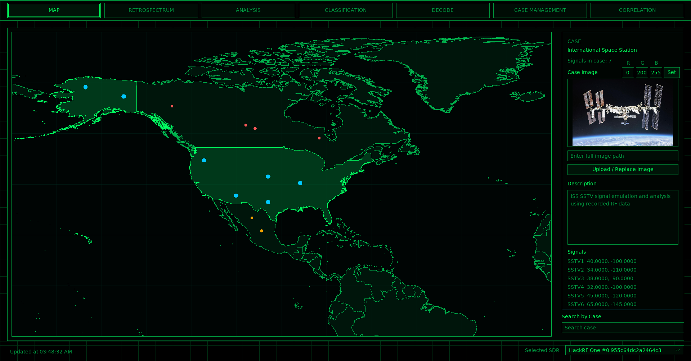
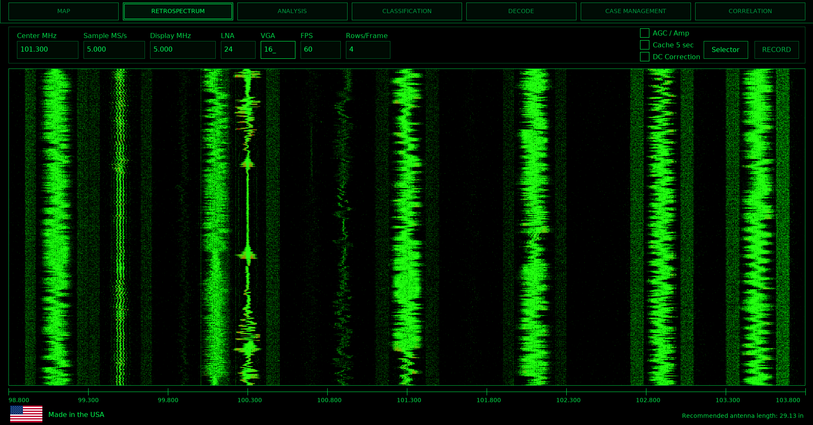
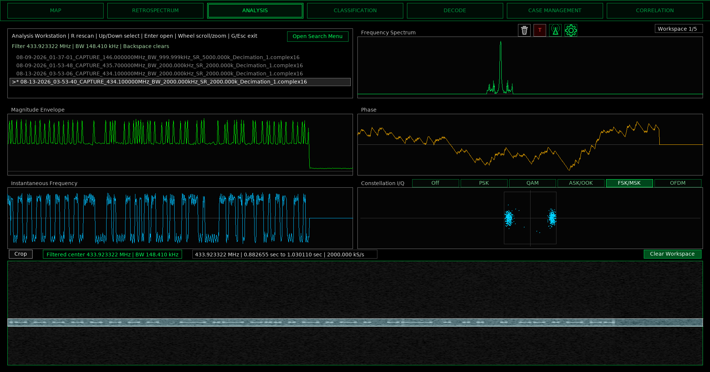
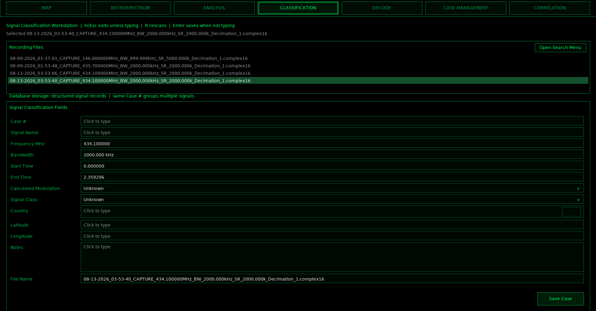
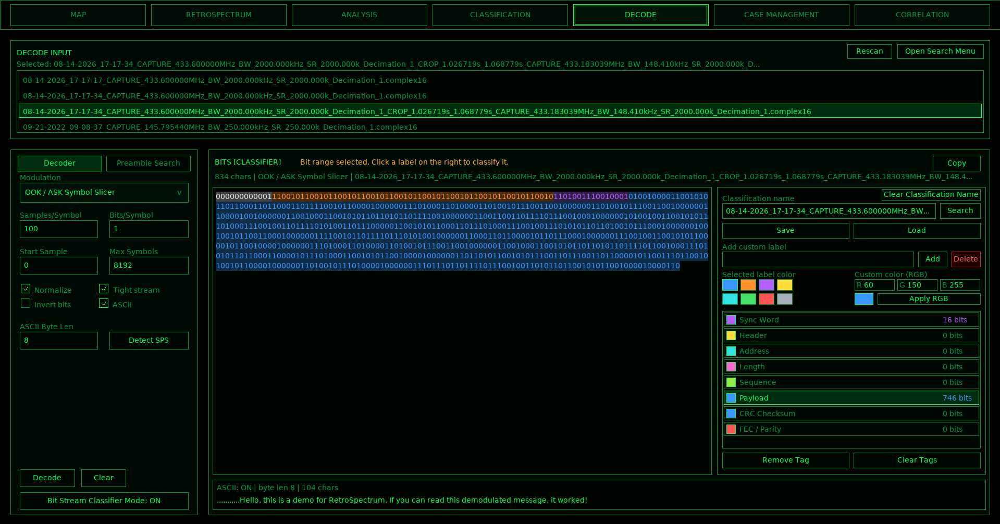
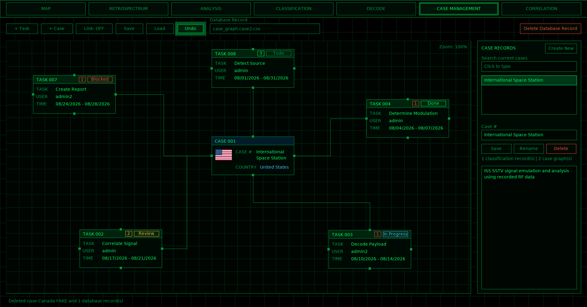
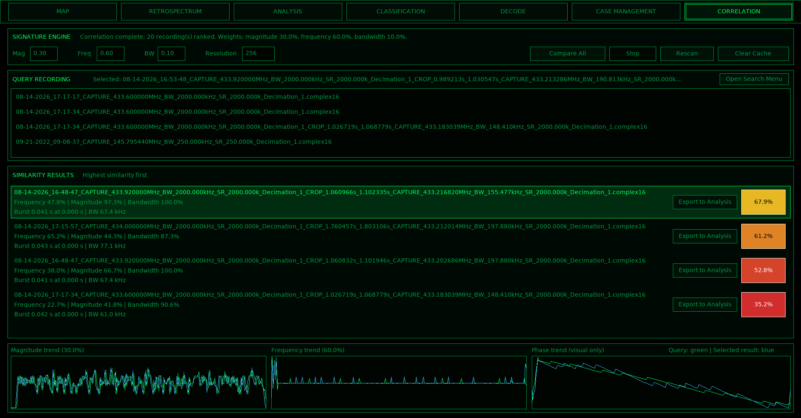

# RetroSpectrum

RetroSpectrum is a software-defined radio environment for spectrum monitoring, signal analysis, classification, decoding, case management, mapping, and signal correlation. 

It enables multiple users to centralize their data while providing post-quantum secure connections.

## Requirements

- Linux System

An SDR supported through SoapySDR is required for live spectrum acquisition. Recorded `.complex16` IQ files can also be analyzed without live reception.

## Quick Start

Install the project dependencies:

```bash
sudo bash scripts/install-dependencis.sh
```

Start RetroSpectrum in server mode and use `Recs` as the recordings directory:

```bash
./build/retrospectrum -S -o Recordings
```

---

## Workstations

RetroSpectrum is organized around dedicated workstations. Each workstation focuses on a specific stage of the RF analysis workflow while sharing recordings, case information, and other project data through the application.

### Map Workstation



The Map workstation provides the geographic case view. It supports:

- Case locations plotted on the world map
- Case selection
- Case-specific colors
- Case images
- Case descriptions
- Signal listings
- Case search
- SDR selection

The map provides a geographic layer over classified signals and case-management data, allowing related RF observations to be reviewed spatially.

### RetroSpectrum



The RetroSpectrum workstation is the live RF spectrum interface. It provides:

- Live waterfall and spectrum monitoring
- Configurable center frequency, sample rate, display span, LNA, VGA, FPS, and waterfall row rate
- SDR selection
- Recording controls
- Signal selector
- AGC/amplifier control
- DC correction
- Pre-record cache support

This workstation is the main entry point for capturing RF activity and creating recordings for later analysis.

### Analysis Workstation



The Analysis workstation provides detailed inspection of recorded IQ data. It includes:

- Frequency spectrum
- Magnitude envelope
- Phase
- Instantaneous frequency
- Constellation/IQ analysis
- Spectrogram view
- Time and frequency filtering
- Cropping and export of selected signal regions
- Multiple analysis workspaces
- Modulation-oriented constellation modes

The workstation is designed for isolating a signal and examining its spectral, amplitude, phase, frequency, and constellation behavior before classification or decoding.

### Classification Workstation



The Classification workstation is used to associate structured metadata with a recorded signal. It supports:

- Case association
- Signal name
- Frequency and bandwidth
- Start and end time
- Calculated modulation
- Signal class
- Country
- Latitude and longitude
- Notes
- Source filename

Classification records are stored as structured signal records in the RetroSpectrum database and can be grouped under a common case number.

### Decode Workstation



The Decode workstation is used to demodulate and inspect recorded digital signals. It provides:

- Modulation-specific decoding
- Samples-per-symbol configuration
- Automatic SPS detection
- Bits-per-symbol configuration
- Start-sample control
- Maximum-symbol limits
- Normalization
- Bit inversion
- Tight-stream output
- ASCII conversion
- Preamble search
- Bit-stream classification and labeling
- Custom classification labels and colors
- Saved bit-stream classification data

Supported decoding paths include OOK/ASK, PSK, QAM, FSK-family modes, AFSK, and SSTV VIS processing through the GNU Radio decoding helper.

### Case Management Workstation



The Case Management workstation provides a graph-oriented environment for organizing investigations. It supports:

- Case blocks
- Task blocks
- Links between related blocks
- Assignment information
- Task status and priority
- Date ranges
- Case search
- Case descriptions
- Save and load operations
- Undo
- Case rename and deletion
- Association with classification records and saved case graphs

The workspace is intended to organize signals, tasks, and investigative context visually instead of treating each recording as an isolated item.

### Correlation Workstation



The Correlation workstation compares recordings and ranks them by similarity. It includes:

- Magnitude similarity
- Frequency similarity
- Bandwidth similarity
- Adjustable weighting
- Configurable comparison resolution
- Ranked similarity results
- Burst information
- Magnitude trend comparison
- Frequency trend comparison
- Phase trend visualization
- Export of selected results back to Analysis

This workstation is intended to help identify recordings with related RF characteristics.

---

## Typical Workflow

A common RetroSpectrum workflow is:

```text
RetroSpectrum
    ↓
Capture or select an IQ recording
    ↓
Analysis
    ↓
Isolate and inspect the signal
    ↓
Classification
    ↓
Store structured signal metadata
    ↓
Decode
    ↓
Recover and classify bit-stream content
    ↓
Case Management / Map
    ↓
Organize related signals and investigation context
    ↓
Correlation
    ↓
Compare recordings and identify similar RF activity
```

Each workstation can also be used independently depending on the task.

## Server and Client

Start the server:

```bash
./build/retrospectrum -S -o Recordings
```

Start a client:

```bash
./build/retrospectrum -C -o Recordings
```

The server hosts the shared RetroSpectrum data, while clients connect to the server for multi-user access.

## Recordings

RetroSpectrum works with recorded complex IQ data, including `.complex16` recordings. Recording metadata such as center frequency, bandwidth, sample rate, decimation, and capture information is carried in the recording filename and is used throughout the application.

## Documentation

Source documentation can be viewed in 'docs/' which includes DSP and Security related documentation as well.

## License

GNU GENERAL PUBLIC LICENSE Version 3
